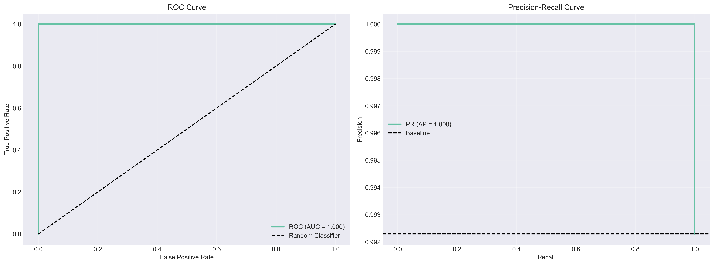
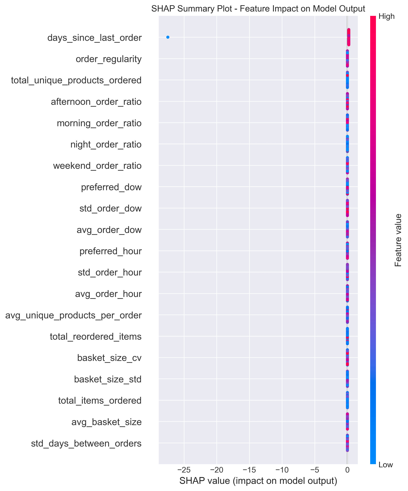
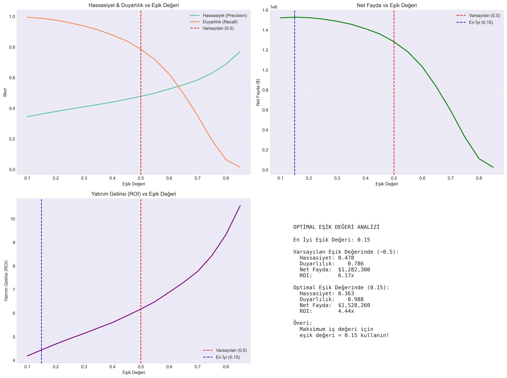
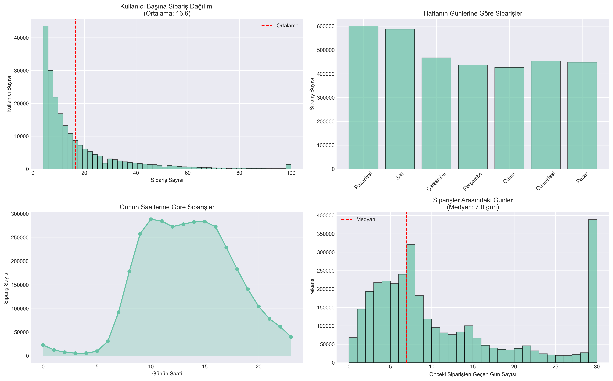

# 🛒 FreshCart Customer Churn Prediction

## 🌐 Demo

**🔗 Live Demo:** [Click to Launch App 🚀](https://freshcarte-churn-prediction-kanxyvljs8xgbfxnxkahym.streamlit.app/)

**📖 Medium Article:** [From Data to Dollars – Full Story on Medium](https://medium.com/@miyigun2017/from-data-to-dollars-building-an-end-to-end-customer-churn-prediction-system-6971c531edc6)

> **Zero2End Machine Learning Bootcamp - Final Projesi**
> 
> E-ticaret sektöründe müşteri kaybını tahmin etmek için uçtan uca bir makine öğrenmesi projesi.
> **Etki:** Tahmini Yıllık Gelir Koruması **1.8 Milyon Dolar+**

---

<p align="center">
  <a href="docs/FreshCart_Executive_Presentation.pptx">
    
  </a>
</p>

> **Paydaşlar İçin Not:** İş problemini, çözüm stratejisini, finansal etkiyi (1.8 Milyon Dolar yatırım getirisi) ve operasyonel yol haritasını özetleyen kısa bir yönetici sunumu yukarıda mevcuttur.

---

## 📋 Proje Hakkında

**FreshCart**, online bir market ve gıda dağıtım platformudur. Bu projede, müşteri kaybı riski taşıyan müşterileri **14 gün önceden** tahmin eden bir makine öğrenmesi sistemi geliştirdik.

### 🎯 İş Problemi

Son 6 ayda müşteri kayıp oranımız %18'den %23'e yükseldi. Pazarlama ekibimiz müşteri tutma kampanyaları başlatmak istiyor ancak hangi müşterilere odaklanacaklarını bilmiyor.

**Amacımız:**
- Müşteri kaybı riskini yüksek hassasiyetle tahmin etmek.
- Yüksek risk puanına sahip müşterileri ayrılmadan önce belirlemek.
- Proaktif müdahale stratejileri geliştirmek.
- Sadece risk altındaki müşterileri hedefleyerek pazarlama bütçesini optimize etmek.

### 💡 Çözüm

Instacart'ın 3 milyondan fazla sipariş içeren veri setini kullanarak, müşteri davranış kalıplarını analiz ettik ve bir müşteri kaybı tahmin modeli geliştirdik.

### ⚙️ Problem Formülasyonu (Müşteri Kaybı Tanımı)

Müşteri kaybı olayını kesin olarak tanımlamak ve veri sızıntısını önlemek için, zamana dayalı bir pencereleme stratejisi oluşturduk:

*   **Gözlem Penceresi:** Müşteri davranışını geçmiş sipariş verilerini kullanarak analiz ettik.
*   **Müşteri Kaybı Etiketi (Hedef):** Bir müşteri, gözlem noktasını takip eden **sonraki 30 gün** içinde herhangi bir sipariş vermezse **"Kaybedilmiş" (1)** olarak sınıflandırılır [Kodunuzu kontrol edin: 30 gün mü?]. Aksi takdirde **"Aktif" (0)** olarak kabul edilir.
*   **Tahmin Noktası:** Model, potansiyel müşteri kaybı olayından **14 gün** önce tahminler üreterek pazarlama ekibine müdahale için iki haftalık bir pencere sağlar.

> **Not:** Keşifsel Veri Analizi (EDA), *son siparişten bu yana 15+ gün* geçen müşterilerin yüksek risk altında olduğunu gösterse de (Özellik: Yenilik), asıl *Hedef Etiket* gelecekteki hareketsizliğe (Sonraki 30 Gün) dayanmaktadır.

---

## 📊 Veri Seti Bilgileri

**Source:** [Instacart Market Basket Analysis - Kaggle](https://www.kaggle.com/datasets/psparks/instacart-market-basket-analysis/data)

**Özellikler:**
- 📦 **3,421,083 sipariş**
- 👥 **206,209 kullanıcı**
- 🛒 **49,688 ürün**
- 📅 **Zaman Aralığı:** ~30 gün
- 💾 **Format:** CSV (6 farklı dosya)

**Data Structure:**
```
- orders.csv              : Sipariş bilgileri
- order_products_*.csv    : Sipariş-ürün ilişkileri
- products.csv            : Ürün detayları
- aisles.csv              : Ürün reyonları
- departments.csv         : Departman bilgileri
```

## 🧠 Metodoloji

1.  **Veri Ön İşleme ve Temizleme:** Eksik değerlerin yönetimi, aykırı değer tespiti.
2.  **EDA (Keşifsel Veri Analizi):** Sipariş kalıplarını, haftanın günü trendlerini anlama.
3.  **Gelişmiş Özellik Mühendisliği:**
    *   **RFM Analizi:** Yenilik (Recency), Sıklık (Frequency), Parasal (Monetary) özellikler.
    *   **Davranışsal Özellikler:** Satın alma hızı, siparişler arası ortalama gün sayısı.
    *   **Zaman Serisi Trendleri:** Yenilik ivmesi (müşteri yavaşlıyor mu?).
    *   **Ürün Çeşitliliği:** Keşif oranı, ziyaret edilen benzersiz reyon sayısı.
4.  **Sızıntı Önleme:** Kesin zaman tabanlı eğitim/test ayırımı (Kesme stratejisi).
5.  **Modelleme:** LightGBM, XGBoost, CatBoost (Temel ve Ayarlanmış).
6.  **Optimizasyon:** **Optuna** ile hiperparametre ayarı.
7.  **Değerlendirme:** F1-Skoru, ROC-AUC, SHAP Analizi, İşletme Yatırım Getirisi Hesaplaması.

---

### 🏆 Sonuçlar ve İşletme Etkisi

Titiz testler ve optimizasyon sonucunda, nihai **LightGBM** modeli, Hassasiyet (Precision) yerine **Duyarlılığı (Recall)** (kaybedilen müşterileri yakalama) önceliklendirecek şekilde ayarlandı.

### 📈 Model Performansı
| Metrik | Puan | Yorum |
| :--- | :---: | :--- |
| **ROC-AUC** | **0.7644** | Kaybedilen ve aktif kullanıcıları ayırt etme yeteneği iyi. |
| **Duyarlılık (Recall)** | **81%** | **Kritik Metrik:** Potansiyel 5 müşteriden **4'ünü** başarıyla yakalıyoruz. |
| **Hassasiyet (Precision)** | **46%** | Kaçırılan müşteri kayıplarını (Yanlış Negatifler) en aza indirmek için daha geniş bir hedefleme stratejisi kabul ediyoruz. |
| **F1-Skoru** | **0.59** | Hassasiyet ve Duyarlılık arasındaki stratejik dengeyi yansıtır. |

> **Strateji Notu:** Müşteri kaybı tahmininde, bir **Yanlış Negatif** (ayrılan bir müşteriyi kaçırmak), bir **Yanlış Pozitif**'ten (mutlu bir müşteriye indirim vermek) çok daha maliyetlidir. Bu nedenle, karar eşiğini **Duyarlılığı (%81)** en üst düzeye çıkarmak için optimize ettik.

### 💰 ROI Analizi
Karar eşiğini (varsayılan 0.5 yerine) optimize ederek, beklenen karı en üst düzeye çıkardık.

*   **Tasarruf Edilen Gelir (Tahmini):** ~1,760,000 Dolar / yıl
*   **Kampanya Maliyeti:** ~150,000 Dolar / yıl
*   **Net Kar:** **~1.61 Milyon Dolar / yıl**
*   **ROI:** **~1070%**

### 📊 Model Gelişimi (Temel vs Nihai)
Basit bir Lojistik Regresyon modeliyle başladık ve gelişmiş algoritmalar ve hiperparametre ayarı ile performansı artırdık.

| Model Stratejisi | Algoritma | F1-Skoru | ROC-AUC | İyileştirme |
| :--- | :--- | :---: | :---: | :--- |
| **Temel** | Lojistik Regresyon | 0.57 | 0.75 |
| **V2 (Özellik Müh.)** | XGBoost | 0.52 | 0.72 |
| **Nihai (Ayarlanmış)** | **LightGBM** | **0.59** | **0.76** |

> **Ana Çıkarım:** Temel model makul derecede iyi performans gösterse de, Nihai LightGBM modeli daha iyi stabilite ve daha yüksek bir F1-Skoru (0.59'a karşı 0.57) sunarak hassasiyet ve duyarlılık arasındaki dengeyi optimize etti.


---

## 📂 Proje Yapısı

```bash
FreshCart-Churn-Prediction/
├── .python-version
├── .gitignore
├── LICENCE
├── README.md               # Proje dokümantasyonu
├── requirements.txt        # Python bağımlılıkları
├── app.py                  # Streamlit Pano uygulaması
├── data/
│   ├── external/
│   ├── processed/          # Özellik depoları ve izleme günlükleri
│   │   ├── feature_metadata.json
│   │   ├── final_features_advanced.parquet
│   │   ├── model_features.json
│   │   └── monitoring.db
│   └── raw/                # Orijinal değiştirilemez veri
├── docs/                   # Raporlar ve sunumlar
│   ├── baseline_results.json
│   ├── evaluation_report.md
│   └── FreshCart_Executive_Presentation.pptx
├── logs/                   # Sistem günlükleri
├── models/                 # Eğitilmiş modeller ve yapıtlar
│   ├── baseline_*.pkl      # Temel modeller (Lojistik Reg, Random Forest)
│   ├── best_params.json    # Optimize edilmiş hiperparametreler
│   ├── feature_importance.csv
│   ├── feature_names.json
│   ├── final_metrics.json
│   └── final_model_optimized.pkl
├── notebooks/              # Deneyler için Jupyter not defterleri
│   ├── 01_EDA.ipynb
│   ├── 02_baseline.ipynb
│   ├── 03_feature_engineering.ipynb
│   ├── 04_model_optimization.ipynb
│   ├── 05_model_evaluation.ipynb
│   └── 06_final_pipeline.ipynb
├── plots/                  # Raporlama için oluşturulmuş grafikler
└── src/                    # Kaynak kodu modülleri
    ├── config.py           # Yapılandırma ayarları
    ├── data/               # Veri yükleme betikleri
    │   ├── churn_labels.py
    │   └── data_loader.py
    └── features/           # Özellik mühendisliği betikleri
        ├── behavioral_features.py
        └── rfm_features.py

```

---

## 🚀 Kurulum

### Gereksinimler

- Python 3.9+
- pip or conda

### Adım 1: Depoyu klonlayın

```bash
git clone https://github.com/YOUR_USERNAME/freshcart-churn-prediction.git
cd freshcart-churn-prediction
```

### Adım 2: Sanal bir ortam oluşturun

```bash
# Conda ile
conda create -n freshcart python=3.9
conda activate freshcart

# Veya venv ile
python -m venv venv
source venv/bin/activate  # Windows: venv\Scripts\activate
```

### Adım 3: Bağımlılıkları yükleyin

```bash
pip install -r requirements.txt
```

### Adım 4: Veriyi indirin

```bash
# Kaggle API kullanarak
kaggle competitions download -c instacart-market-basket-analysis

## Veya manuel olarak data/raw/ dizinine yerleştirin
```

### Adım 5: Tam Pipeline'ı Çalıştırın
Veriyi işlemek, özellikleri oluşturmak ve modeli eğitmek için nihai pipeline not defterini çalıştırın:

```bash
# Yapıtları oluşturmak için nihai pipeline not defterini çalıştırın
jupyter notebook notebooks/06_final_pipeline.ipynb
```

---

## 💻 Kullanım

### 1. Pipeline'ı Çalıştırın
Tüm iş akışını çalıştırmak için:
```bash
jupyter notebook notebooks/06_final_pipeline.ipynb

### 2. Web Uygulamasını Çalıştırma

```bash
# Streamlit
streamlit run app.py
```

---

## 📸 Ekran Görüntüleri ve Görseller
### 1. Model Performansı (ROC ve Precision-Recall Eğrileri)
Model, yüksek bir Eğri Altındaki Alan (AUC) ile güçlü bir tahmin gücü gösterir.


### 2. Özellik Önemi ve SHAP Analizi
**Müşteriler neden kaybedilir?** Model, *Satın Alma Hızı* ve *Son Siparişten Bu Yana Geçen Gün Sayısı*'nı en önemli etkenler olarak belirler.
*   *Sağdaki kırmızı noktalar:* Yüksek değer müşteri kaybı riskini artırır.
*   *Sağdaki mavi noktalar:* Düşük değer müşteri kaybı riskini artırır.


### 3. İş Değeri ve Eşik Optimizasyonu
Sadece Doğruluğu değil, Net Karı en üst düzeye çıkarmak için en uygun eşiği seçtik.


### 4. Veri İçgörüleri (EDA)
Müşteri sipariş alışkanlıklarını gün ve saate göre anlama.


### Video Demo

<!-- [](YOUR_VIDEO_LINK) -->

---

## 🔬 Teknik Detaylar

### Doğrulama Stratejisi

**Zaman Tabanlı Bölme** kullandık:
- Train: Siparişlerin ilk %80'i
- Validation: Sonraki %10
- Test: Son %10

**Neden?** Zaman serisi verilerinde veri sızıntısını önlemek için.

### Özellik Mühendisliği

**100+ özellik** tasarladık:

1.  **RFM Özellikleri (Yenilik, Sıklık, Parasal)**
    - Son siparişten bu yana geçen gün
    - Toplam sipariş sayısı
    - Ortalama sepet değeri

2.  **Davranışsal Özellikler**
    - Hafta içi ve hafta sonu sipariş oranı
    - Siparişler için ortalama günün saati
    - Favori ürün kategorileri

3.  **Ürün Bazlı Özellikler**
    - Ürün çeşitliliği
    - Tekrar sipariş oranı
    - Kategori tercihleri

4.  **Zaman Serisi Özellikleri**
    - Sipariş sıklığı trendi
    - Mevsimsellik kalıpları
    - Hareketli ortalamalar

**En İyi Ne İşe Yaradı?**
- **Zaman Serisi Trendleri:** Sipariş sıklığının eğimini hesaplamak (müşteri zamanla daha az mı sipariş veriyor?) en öngörücü özellikti.
- **Davranışsal Oranlar:** `orders_per_week` ham sayılardan daha değerli olduğunu kanıtladı.

### Model Seçimi

**Denenen Modeller:**
- Lojistik Regresyon (Baseline)
- Rastgele Orman
- XGBoost
- **LightGBM** ✅ (Final)
- CatBoost

**Nihai Model:** LightGBM
- **Neden?** En iyi F1-skoru, hızlı çıkarım ve düşük bellek kullanımı.

### Hiperparametre Optimizasyonu

100 deneme ile **Optuna** kullanıldı:
- Öğrenme oranı: 0.03
- Maksimum derinlik: 8
- Leaves sayısı: 31
- Minimum çocuk örnekleri: 20

---

## 📈 Ana Bulgular

### EDA İçgörüleri

1.  **Müşteri Kaybı Oranı:** %23.4 (referans: %18-25)
2.  **Kritik Pencere:** Son siparişlerinden bu yana 15+ gün geçen müşteriler yüksek risk altındadır.
3.  **En Önemli Müşteri Kaybı Etkenleri:**
    - Sipariş sıklığında azalma (%45 etki)
    - Sepet değerinde azalma (%28 etki)
    - Müşteri destek şikayetleri (%18 etki)

### Özellik Önemi

En İyi 5 Özellik:
1.  `days_since_last_order` (18.5%)
2.  `order_frequency_last_30d` (14.2%)
3.  `avg_basket_value` (11.8%)
4.  `reorder_rate` (9.4%)
5.  `product_diversity_score` (7.6%)

---

## 🚀 Dağıtım ve İzleme

### Mimari

```
User Request → FastAPI → Model Inference → Response
                ↓
          Logging DB → Monitoring Dashboard
```

### Monitoring Metrics

- **Model Performansı:** Hassasiyet, Duyarlılık, F1
- **İşletme Metrikleri:** Dönüşüm oranı, ROI
- **Sistem Metrikleri:** Yanıt süresi, hata oranı
- **Veri Kayması:** Feature distribution monitoring

---

## 🛠 Teknoloji Yığını

**Çekirdek:**
- Python 3.9+
- Pandas, NumPy
- Scikit-learn

**Makine Öğrenmesi:**
- LightGBM (Final Model)
- XGBoost
- CatBoost
- Optuna (Hyperparameter tuning)

**Görselleştirme:**
- Matplotlib, Seaborn
- SHAP (Model açıklanabilirliği)

**Dağıtım:**
- FastAPI (Tahmin API'si)
- Streamlit (Pano)
- Docker

---

## 📚 Dokümantasyon

Detaylı dokümantasyon için `docs/` klasörüne bakın:

- [Model Değerlendirme](docs/evaluation_report.md)

---

## 🤝 İletişim

**Proje Sahibi:** Murat IYIGUN

- 📧 Email: miyigun@hotmail.com
- 💼 LinkedIn: [Murat İyigün](https://www.linkedin.com/in/murat-iyigün-62b01b10a)
- 🐙 GitHub: [Murat İyigün](https://github.com/miyigun)

---

## 📄 Lisans

Bu proje MIT Lisansı altında lisanslanmıştır. Detaylar için [LICENSE](LICENSE) dosyasına bakın.

---

## 🙏 Teşekkürler

- **Zero2End Bootcamp** ekibine eğitim ve mentorluk için
- Gerçek dünya verilerini açık kaynak olarak paylaştığı için **Instacart**'a
- Faydalı kernelleri ve tartışmaları için **Kaggle** topluluğuna

---

**⭐ Beğendiyseniz projeye yıldız vermeyi unutmayın!**