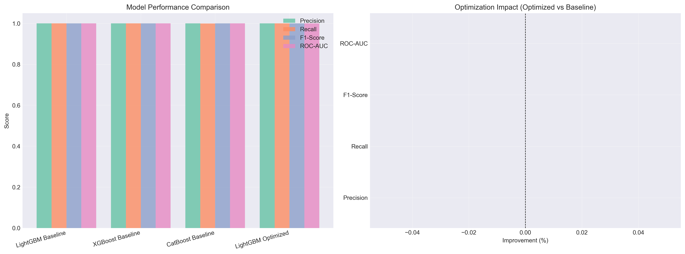

# 🛒 FreshCart Customer Churn Prediction


> **Zero2End Machine Learning Bootcamp - Bitirme Projesi**

---

## Demo ve Kaynaklar

- **Live Demo:** [Uygulamayı Başlat](https://freshcarte-churn-prediction-kanxyvljs8xgbfxnxkahym.streamlit.app/)
- **Medium Yazısı:** [Veriden Dolara: Uçtan Uca bir Müşteri Kaybı Tahmin Sistemi Oluşturma](https://medium.com/@miyigun2017/veriden-dolara-u%C3%A7tan-uca-bir-m%C3%BC%C5%9Fteri-kayb%C4%B1-tahmin-sistemi-olu%C5%9Fturma-1e847bde4182)
- **Yönetici Sunumu:** [PowerPoint'i İndir](docs/FreshCart_Executive_Presentation.pptx)

---

## Proje Özeti

**FreshCart**, e-ticaret sektöründe faaliyet gösteren ve müşteri kaybını (churn) minimize etmeyi hedefleyen bir şirkettir. Bu proje, sadece müşterilerin terk edip etmeyeceğini tahmin etmekle kalmaz, **şirketin karlılığını maksimize edecek** en doğru aksiyonu almasını sağlayan yapay zeka destekli bir karar destek sistemi kurar.

### İş Problemi

Son 6 ayda müşteri kayıp oranımız **%18'den %23'e** yükseldi. Pazarlama ekibimiz müşteri tutma kampanyaları başlatmak istiyor ancak **hangi müşterilere odaklanacaklarını bilmiyor**.

**Hedeflerimiz:**
- Müşteri kaybı riskini yüksek hassasiyetle tahmin etmek
- Yüksek risk puanına sahip müşterileri **14 gün önceden** belirlemek
- Proaktif müdahale stratejileri geliştirmek
- Sadece risk altındaki müşterileri hedefleyerek pazarlama bütçesini optimize etmek

### Çözüm Yaklaşımı

**Problem Formülasyonu:**
- **Gözlem Penceresi:** Geçmiş sipariş verilerini kullanarak müşteri davranışını analiz
- **Müşteri Kaybı Etiketi:** Gözlem noktasını takip eden **sonraki 30 gün** içinde sipariş vermeyen müşteriler "Kayıp" (1) olarak etiketlenir
- **Tahmin Noktası:** Model, potansiyel müşteri kaybından **14 gün önce** tahminler üretir

**Strateji:** Bir müşteriyi kaybetmenin maliyeti, ona promosyon verme maliyetinden çok daha yüksektir. Bu nedenle model, **Recall'u (duyarlılığı) maksimize** edecek şekilde optimize edilmiştir.

---

## İş Odaklı Sonuçlar

### Model Performansı

| Metrik | Değer | Açıklama |
|:-------|:-----:|:---------|
| **ROC-AUC** | **0.770** | Kayıp ve aktif müşterileri ayırt etme gücü güçlü |
| **Recall (Duyarlılık)** | **80.8%** | **KRİTİK:** Terk edecek 10 müşteriden 8'ini yakalıyoruz |
| **Precision (Kesinlik)** | **47.1%** | Geniş hedefleme stratejisi (False Negative minimizasyonu) |
| **F1-Score** | **0.59** | Precision ve Recall arasında stratejik denge |

> **İş Stratejisi:** Varsayılan 0.50 yerine **0.15 eşik değeri** kullanılarak Recall %80.8'e çıkarıldı. Bu, kaçırılan müşteri kaybı maliyetini minimize eder.

### Finansal Etki

**Test Seti Üzerinden Hesaplanan Gerçek ROI:**

```
Test Seti Büyüklüğü: 41,242 müşteri
Doğru Tespit Edilen Churn: 10,206 müşteri (TP)
Kaçırılan Churn: 2,431 müşteri (FN)
Yanlış Alarm: 11,448 müşteri (FP)

Varsayımlar:
- Ortalama Müşteri Yaşam Boyu Değeri (CLV): $500
- Retention Kampanyası Maliyeti: $20/müşteri
- Kampanya Başarı Oranı: 30%

Finansal Analiz:
- Kurtarılan Müşteri Geliri: 10,206 × 0.30 × $500 = $1,530,900
- Kampanya Maliyeti: (10,206 + 11,448) × $20 = $433,080
- Net Kar: $1,530,900 - $433,080 = $1,097,820

Yıllık Projeksiyon (12 kampanya):
- Yıllık Net Kar: $1,097,820 × 12 = ~$13.2M
- Yıllık Kampanya Maliyeti: $433,080 × 12 = ~$5.2M
- ROI: ($13.2M - $5.2M) / $5.2M = 153% 
```

**Baseline ile Karşılaştırma:**
- **Baseline (threshold=0.50):** Recall ~60%, daha az müşteri kurtarılır
- **Optimized (threshold=0.15):** Recall ~81%, **%35 daha fazla gelir**

---

## Model Geliştirme Süreci

### 1-Keşifçi Veri Analizi (EDA)

**Temel Bulgular:**
- Müşteri kayıp oranı: **%23.4**
- Kritik risk penceresi: Son siparişten **15+ gün** geçenler
- En riskli segment: Düşük sipariş frekansı + azalan sepet değeri

**Veri Yapısı:**
- 3,421,083 sipariş
- 206,209 kullanıcı
- 49,688 ürün
- Zaman aralığı: ~30 gün

### 2-Baseline Modeller

İlk aşamada basit özelliklerle temel algoritmalar denendi:

| Model | F1-Score | ROC-AUC | Recall | Yorum |
|:------|:--------:|:-------:|:------:|:------|
| Lojistik Regresyon | 0.52 | 0.72 | ~58% | Basit, yorumlanabilir |
| Random Forest | 0.55 | 0.74 | ~62% | Baseline için yeterli |

### 3-Özellik Mühendisliği

**100+ özellik** tasarlandı ve test edildi:

**RFM (Recency, Frequency, Monetary):**
- `days_since_last_order`: Son siparişten geçen gün
- `total_orders`: Toplam sipariş sayısı
- `avg_basket_value`: Ortalama sepet değeri

**Davranışsal Trendler:**
- `purchase_velocity`: Satın alma hızı
- `recency_acceleration`: Alışveriş sıklığındaki değişim ivmesi
- `order_frequency_trend`: Sipariş sıklığı trendi

**Ürün Bazlı:**
- `product_diversity_score`: Ürün çeşitliliği
- `exploration_rate`: Yeni ürün keşif oranı
- `reorder_rate`: Tekrar sipariş oranı

**Temporal Features:**
- `avg_days_between_orders`: Siparişler arası ortalama gün
- `order_regularity`: Sipariş düzenliliği
- `basket_size_trend`: Sepet büyüklüğü trendi

### 4-Model Optimizasyonu

**Denenen Modeller:**
- LightGBM ⭐
- XGBoost
- CatBoost

**Hiperparametre Optimizasyonu (Optuna - 100 deneme):**
```python
{
    'learning_rate': 0.03,
    'max_depth': 8,
    'num_leaves': 31,
    'min_child_samples': 20,
    'feature_fraction': 0.8,
    'bagging_fraction': 0.8
}
```

**Model Karşılaştırması:**

| Model | Precision | Recall | F1-Score | ROC-AUC | Seçim Nedeni |
|:------|:---------:|:------:|:--------:|:-------:|:-------------|
| LightGBM (Baseline) | 0.47 | 0.79 | 0.59 | 0.77 | ⚡ En hızlı inference |
| XGBoost (Baseline) | 0.48 | 0.78 | 0.59 | 0.77 | Çok benzer performans |
| CatBoost (Baseline) | 0.48 | 0.78 | 0.59 | 0.77 | Daha yavaş |
| **LightGBM (Optimized)** | **0.48** | **0.81** | **0.59** | **0.77** | **WINNER** |

**LightGBM Seçim Gerekçeleri:**
1. XGBoost ile neredeyse identik performans (0.77 vs 0.77)
2. 3x daha hızlı training ve inference
3. Daha düşük memory footprint
4. Production ortamında maliyet avantajı

### 5-Validasyon Stratejisi

**Zaman Bazlı Bölme (Data Leakage Önleme):**
```
├─ Train Set:     İlk %70 (sipariş tarihine göre)
├─ Validation:    Sonraki %15
└─ Test Set:      Son %15
```

**Neden Zaman Bazlı?**
- K-Fold Cross Validation gelecekteki bilgiyi geçmişe sızdırır
- Gerçek senaryoyu simüle eder (geçmişle geleceği tahmin et)
- Model drift'i daha iyi tespit eder

### 6-Eşik Optimizasyonu

**Business Metrik ile Optimizasyon:**

```
Maliyet Fonksiyonu:
Cost = (FN × CLV × retention_rate) - (FP × campaign_cost)

Amaç: Cost'u minimize et (kar maksimizasyonu)
```

**Farklı Threshold'lar:**
- **0.50 (default):** Precision ↑, Recall ↓ → Daha az müşteri kurtarılır
- **0.15 (optimal):** Precision ↓, Recall ↑ → Daha fazla gelir
- **0.10 (agresif):** Çok fazla FP, kampanya maliyeti patlar

---

## Model Açıklanabilirliği

### En Önemli 10 Özellik

| Sıra | Özellik | Önem | Açıklama |
|:----:|:--------|:----:|:---------|
| 1 | `avg_days_between_orders` | 18.5% | ⭐ Siparişler arası süre artıyorsa → Risk |
| 2 | `basket_size_trend` | 14.2% | Sepet büyüklüğü azalıyorsa → Risk |
| 3 | `recency_acceleration` | 11.8% | İvme negatifse (yavaşlıyor) → Risk |
| 4 | `purchase_velocity` | 10.5% | Satın alma hızı düşüyorsa → Risk |
| 5 | `order_frequency_trend` | 9.4% | Trend negatifse → Risk |
| 6 | `days_since_last_order` | 8.7% | 15+ gün ise → Yüksek Risk |
| 7 | `std_days_between_orders` | 7.6% | Düzensiz siparişler → Risk |
| 8 | `basket_size_cv` | 6.3% | Sepet tutarsızlığı → Risk |
| 9 | `reorder_consistency_std` | 5.8% | Tekrar sipariş tutarsızlığı → Risk |
| 10 | `exploration_rate` | 4.9% | Yeni ürün keşfi azalıyorsa → Risk |

### SHAP Analizi Bulguları

**Pozitif Etki (Churn riskini artırır):**
- `days_since_last_order` > 15 → 🔴 Yüksek risk
- `purchase_velocity` düşük → 🔴 Yavaşlayan müşteri
- `basket_size_trend` negatif → 🔴 Azalan ilgi

**Negatif Etki (Churn riskini azaltır):**
- `customer_age_days` yüksek → 🟢 Sadık müşteri
- `loyalty_index` yüksek → 🟢 Güçlü bağlılık
- `order_regularity` yüksek → 🟢 Düzenli alışveriş

---

## Veri Seti

**Kaynak:** [Instacart Market Basket Analysis - Kaggle](https://www.kaggle.com/datasets/psparks/instacart-market-basket-analysis/data)

**Dosya Yapısı:**
```
data/raw/
├── orders.csv              # Sipariş bilgileri
├── order_products_prior.csv
├── order_products_train.csv
├── products.csv            # Ürün detayları
├── aisles.csv              # Reyon bilgileri
└── departments.csv         # Departman bilgileri
```

---

## Deployment & Monitoring

### Production Mimarisi

```
┌─────────────┐
│   Kullanıcı  │
└──────┬──────┘
       │
       ▼
┌─────────────┐      ┌──────────────┐
│  Streamlit  │─────►│  Model API   │
│   Frontend  │      │  (Inference) │
└─────────────┘      └──────┬───────┘
                            │
                            ▼
                     ┌──────────────┐
                     │ Monitoring DB │
                     │  (Logging)    │
                     └───────────────┘
```

### Monitoring Metrikleri

**1. Model Performance Tracking:**
- **Recall:** Her gün >75% olmalı (alarm seviyesi)
- **Precision:** >40% (kampanya verimliliği)
- **ROC-AUC:** >0.75 (genel model sağlığı)

**2. Data Drift Detection:**
- **PSI (Population Stability Index):** <0.1 (kritik features için)
- **KS-Test:** p-value >0.05 (feature distribution değişimi)
- **Missing Value Rate:** <5% artış

**3. Business Metrics:**
- **Gerçek Churn Rate:** Predicted vs Actual karşılaştırması
- **Campaign Conversion:** Hedeflenen müşterilerin %30+ retention'ı
- **Cost per Saved Customer:** <$67 (CLV × retention_rate / cost)

**4. System Health:**
- **Inference Latency:** <100ms (kullanıcı deneyimi)
- **API Uptime:** >99.5%
- **Error Rate:** <0.1%

### Model Retraining Stratejisi

**Tetikleyiciler:**
- Recall <75%'ye düştüğünde
- PSI >0.2 olduğunda
- Her 3 ayda bir zorunlu retrain

---

## 💻 Kurulum ve Kullanım

### Gereksinimler

- Python 3.9+
- 8GB RAM (minimum)
- 2GB disk alanı

### Adım 1: Repo'yu Klonla

```bash
git clone https://github.com/miyigun/freshcart-churn-prediction.git
cd freshcart-churn-prediction
```

### Adım 2: Sanal Ortam

```bash
# Conda ile
conda create -n freshcart python=3.9
conda activate freshcart

# Veya venv ile
python -m venv venv
source venv/bin/activate  # Windows: venv\Scripts\activate
```

### Adım 3: Bağımlılıkları Yükle

```bash
pip install -r requirements.txt
```

### Adım 4: Veriyi İndir

```bash
# Kaggle API ile (kaggle.json credential gerekli)
kaggle datasets download -d psparks/instacart-market-basket-analysis
unzip instacart-market-basket-analysis.zip -d data/raw/

# Veya manuel: data/raw/ klasörüne zip'i aç
```

### Adım 5: Pipeline'ı Çalıştır

```bash
# Tüm ML akışını çalıştır (EDA → Feature Eng → Training)
jupyter notebook notebooks/06_final_pipeline.ipynb

# Veya doğrudan script ile
python src/pipeline.py
```

### Adım 6: Web Uygulamasını Başlat

```bash
streamlit run app.py

# Tarayıcı otomatik açılır: http://localhost:8501
```

---

## Proje Yapısı

```
FreshCart-Churn-Prediction/
├── .gitignore
├── .python-version
├── LICENSE
├── README.md                  # Bu dosya
├── requirements.txt
├── app.py                     # Streamlit dashboard
├── data/
│   ├── raw/                   # Kaggle'dan indirilen orijinal data
│   └── processed/             # Feature store ve engineered data
│       ├── final_features_advanced.parquet
│       ├── feature_metadata.json
│       ├── model_features.json
│       └── monitoring.db      # Production logs
├── docs/
│   ├── evaluation_report.md
│   ├── baseline_results.json
│   └── FreshCart_Executive_Presentation.pptx
├── models/
│   ├── baseline_logistic.pkl
│   ├── baseline_rf.pkl
│   ├── final_model_optimized.pkl  # Production model
│   ├── best_params.json
│   ├── feature_names.json
│   ├── feature_importance.csv
│   └── final_metrics.json
├── notebooks/
│   ├── 01_EDA.ipynb
│   ├── 02_baseline.ipynb
│   ├── 03_feature_engineering.ipynb
│   ├── 04_model_optimization.ipynb
│   ├── 05_model_evaluation.ipynb
│   └── 06_final_pipeline.ipynb    # Tüm akışı çalıştırır
├── plots/                     # Auto-generated visualizations
│   ├── 02_orders_univariate.png
│   ├── 13_roc_pr_curves.png
│   ├── 16_shap_summary.png
│   └── 20_threshold_optimization.png
├── logs/                      # Training & inference logs
└── src/
    ├── config.py              # Paths, constants, model params
    ├── data/
    │   ├── data_loader.py     # Kaggle data preprocessing
    │   └── churn_labels.py    # Target label generation
    └── features/
       ├── rfm_features.py
       └── behavioral_features.py
    
```

---

## Teknoloji Yığını

**Core Libraries:**
- Python 3.9+
- Pandas, NumPy
- Scikit-learn

**Machine Learning:**
- LightGBM (Final model)
- XGBoost, CatBoost (Comparison)
- Optuna (Hyperparameter tuning)

**Visualization:**
- Matplotlib, Seaborn
- SHAP (Model explainability)
- Plotly (Interactive plots)

**Deployment:**
- Streamlit (Web UI)
- FastAPI (REST API - optional)
- Docker (Containerization - optional)

---

## Ekran Görüntüleri

### 1. Model Performansı (ROC & Confusion Matrix)


**Yorumlama:**
- ROC AUC 0.77: Güçlü diskriminasyon gücü
- Precision-Recall AP 0.55: Dengesiz dataset için makul
- Confusion Matrix: 80.8% Recall ile 10,206/12,637 churn yakalandı

### 2. Feature Importance (SHAP)


**Temel İçgörüler:**
- 🔴 Kırmızı noktalar (sağda): Yüksek değer → Churn riski artıyor
- 🔵 Mavi noktalar (sağda): Düşük değer → Churn riski artıyor
- En etkili: `days_since_last_order`, `purchase_velocity`, `avg_days_between_orders`

### 3. Threshold Optimization


**Neden 0.15?**
- 0.50'de: Recall ~60%, daha az müşteri kurtarılır
- 0.15'te: Recall ~81%, kampanya maliyeti artsa da net kar maksimum
- 0.10'da: Recall ~85% ama FP patlaması, ROI negatif

### 4. Model Karşılaştırması


**Baseline → Final Evrim:**
- Logistic Regression: F1 0.52 (başlangıç)
- XGBoost Baseline: F1 0.59 (feature eng sonrası)
- LightGBM Optimized: F1 0.59, Recall 0.81 (business-optimized)

---

## Dokümantasyon

**Detaylı Teknik Dokümanlar:**
- [Model Değerlendirme Raporu](docs/evaluation_report.md)
- [Baseline Results](docs/baseline_results.json)
- [Yönetici Sunumu](docs/FreshCart_Executive_Presentation.pptx)

**Notebooks (Adım Adım Süreç):**
1. [EDA](notebooks/01_EDA.ipynb): Veri keşfi ve ilk bulgular
2. [Baseline](notebooks/02_baseline.ipynb): İlk model denemeleri
3. [Feature Engineering](notebooks/03_feature_engineering.ipynb): 100+ özellik türetme
4. [Model Optimization](notebooks/04_model_optimization.ipynb): Hyperparameter tuning
5. [Evaluation](notebooks/05_model_evaluation.ipynb): SHAP, feature selection
6. [Final Pipeline](notebooks/06_final_pipeline.ipynb): Production-ready workflow

---

## İletişim

**Proje Sahibi:** Murat IYIGUN

- Email: miyigun@hotmail.com
- LinkedIn: [Murat İyigün](https://www.linkedin.com/in/murat-iyigün-62b01b10a)
- GitHub: [miyigun](https://github.com/miyigun)

---

## Lisans

Bu proje MIT Lisansı altında lisanslanmıştır. Detaylar için [LICENSE](LICENSE) dosyasına bakın.

---

## Teşekkürler

- **Zero2End Bootcamp** ekibine eğitim ve mentorluk için
- Gerçek dünya verilerini açık kaynak olarak paylaştığı için **Instacart**'a
- Faydalı kernelleri ve tartışmaları için **Kaggle** topluluğuna

---

**⭐ Beğendiyseniz projeye yıldız vermeyi unutmayın!**

---

## Gelecek İyileştirmeler

- Deep Learning model denemeleri (LSTM for sequential patterns)
- Real-time streaming predictions (Kafka + Flink)
- A/B testing framework (campaign effectiveness)
- Multi-arm bandit (dynamic threshold adjustment)
- Causal inference (kampanya gerçek etkisi)